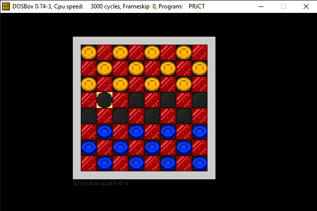
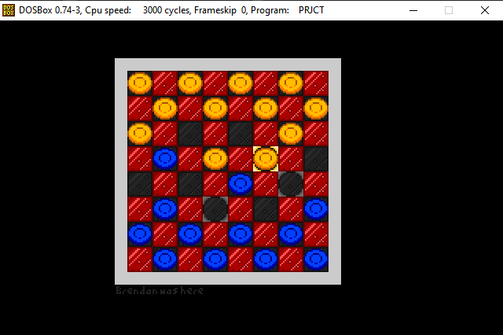
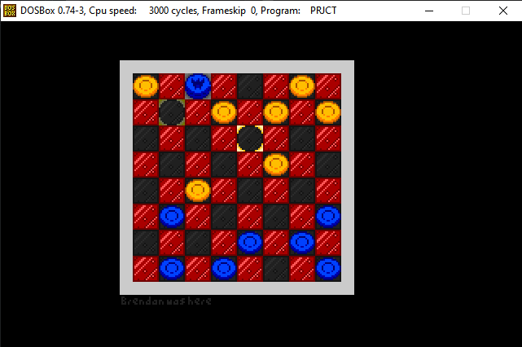
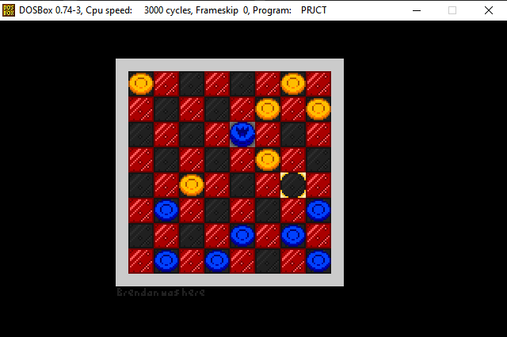

# Checkers in x86 Assembly

My final project for my Computer Architecture class made in May 2022 at FRCC.

For my project, I created an 8 and 16-bit sprite renderer with 2-bit color palettes to simulate a game of checkers in x86 Assembly. It takes input from the user and renders the game state in real time.

## Instructions:

Controls:
 - Move the selected tile using WASD.
 - While hovered over a piece, press E to select it.
 - While a checker is selected, rotate between possible moves using A and D.
 - Press E to move the checker and Q to cancel.

To compile and run using DOSBox and MASM 8086:
```
MASM PRJCTGAM.ASM
MASM PRJCTCHK.ASM
MASM PRJCTDRW.ASM
MASM PRJCTGFX.ASM
MASM PRJCTUI.ASM
LINK PRJCTGAM.ASM PRJCTCHK.ASM PRJCTDRW.ASM PRJCTGFX.ASM PRJCTUI.ASM
CHECKERS

CHECKERS
```

## Screenshots:
### Beginning game state

### Move highlighting

### Upgrading pieces and backwards movement

### Optional recursive jumping

